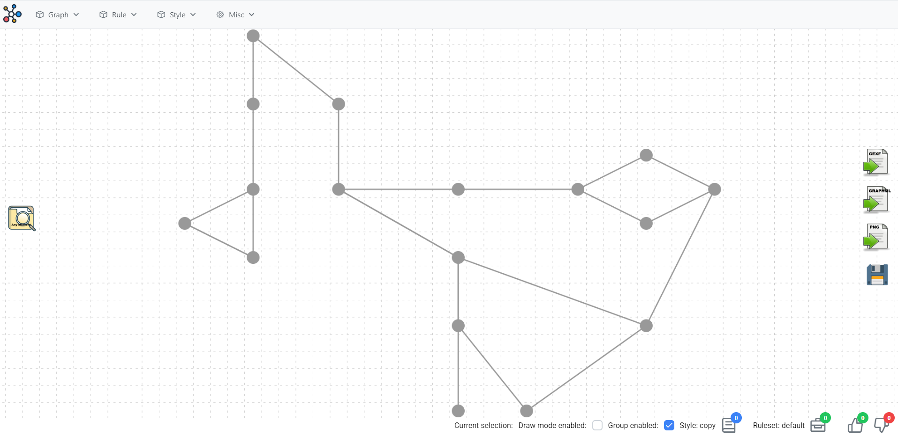
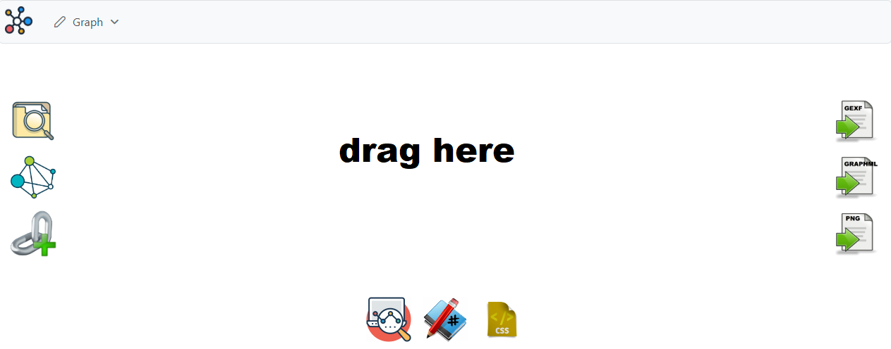
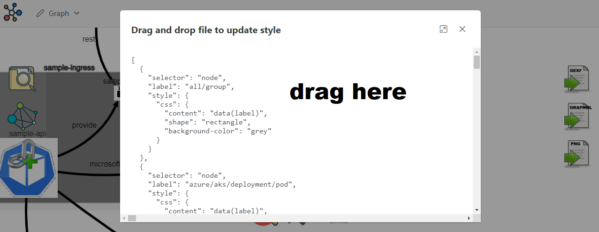

# About

This tool aim to design complex system with a component view target
- based on [cytoscapejs](https://js.cytoscape.org)
- based on [primeng](https://www.primefaces.org/primeng/)
- based on [json-rules-engine](https://github.com/CacheControl/json-rules-engine)

PS : all data is stored in browser local storage

# Demo

Simply go to https://yroffin.github.io/my-system then load sample.gexf as new graph
And use demo tag style stored in asset (cut and paste if thru tag menu)

First create a single graph named sample, then open it with icon selector



In graph editor simply grad and drop sample.gexf onto graph



Last action could be :
- style import by draging style.json sample file
- ruleset import by draging rules.json sample file

And then change graph properties by selecting new style and new ruleset



# How to build

```
npm start
```

# How to deploy

```
ng build --output-path ../docs --base-href /my-system/
```
